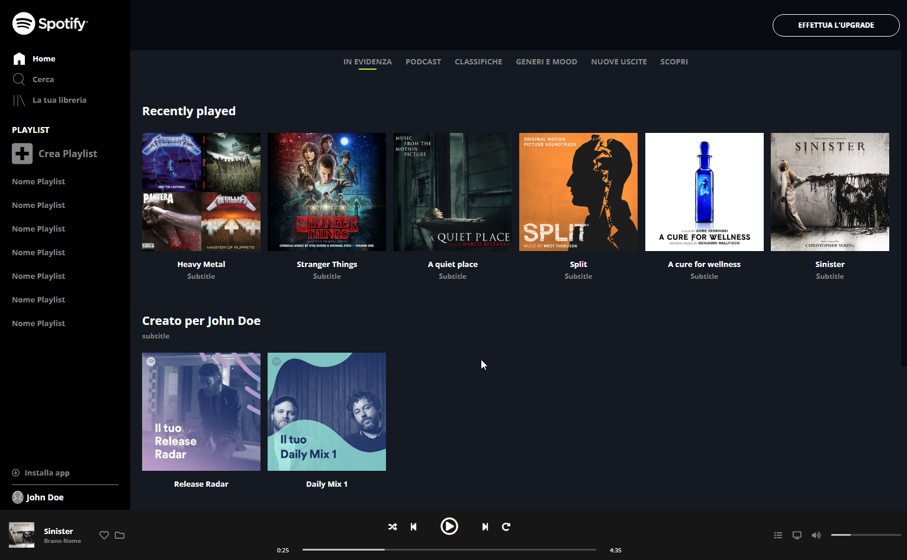

# Spotify-web-clone

## Description

Spotify-web-clone is a static version of Spotify. I did it during my study of Bootstrap and responsive design practice project.

## Features

- Responsive design using Bootstrap and Media Queries.
- Animation on thumbs and buttons. 

## Technology

  
 
  
  

## Demo

To see a live demo of the Spotify-web-clone, visit [Demo](https://www.massidev.com/portfolio/spotify-web-clone/).

## Installation

To run the Spotify-web-clone locally, follow these steps:

1. Clone the repository: `git clone https://github.com/massi-17/spotify-web-clone.git`
2. Navigate to the project directory: `cd spotify-web-clone`
3. Open the `index.html` file in your preferred web browser.

## Contributing

Contributions are welcome! If you want to contribute to this Spotify-web-clone, please follow these steps:

1. Fork the repository.
2. Create a new branch: `git checkout -b feature/your-feature`.
3. Make your changes and commit them: `git commit -m 'Add your feature'`.
4. Push to the branch: `git push origin feature/your-feature`.
5. Submit a pull request.

